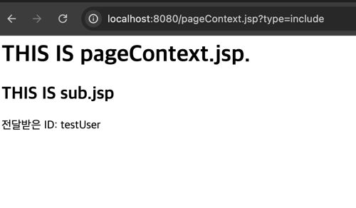
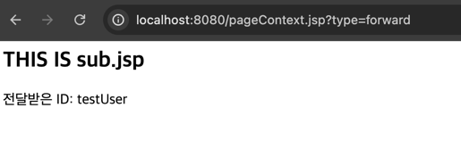
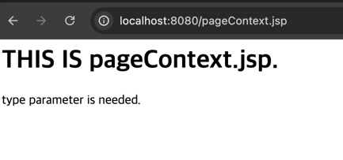

# JSP Action Tag
- JSP 페이지 내에서 어떤 동작을 하도록 지시하는 태그
- XML 태그 형식
- JSP Action Tags는 페이지 간 플로우를 제어
- JSP Action Tags는 Java Bean을 사용하는 데 사용

## 앞선 forward vs include 실습에서

- pageContext.include(''), pageContext.forward('')를
- <jsp:include page='' />, <jsp:forward page='' /> 로 바꿔보자
- <jsp:param />  이용해서 parameter 전달하기
- 전달된 parameter는 request.getParameter("id") 접근할 수 있음

## 2. include와 forward의 Action Tag 사용법

### 기존 방식
```jsp
<% 
   pageContext.include("sub.jsp");
   pageContext.forward("sub.jsp");
%>
```

### Action Tag 방식
```
<%-- include 사용 --%>
<jsp:include page="sub.jsp">
    <jsp:param name="id" value="<%=id%>"/>
</jsp:include>

<%-- forward 사용 --%>
<jsp:forward page="sub.jsp">
    <jsp:param name="id" value="<%=id%>"/>
</jsp:forward>
```

- include 테스트
```http://localhost:8080/pageContext.jsp?type=include```

  - include는 sub.jsp 내용을 현재 페이지에 포함시키므로 두 페이지의 내용이 모두 보임
  - "THIS IS pageContext.jsp"와 "THIS IS sub.jsp" 그리고 전달받은 ID가 모두 표시됨

- forward 테스트

```http://localhost:8080/pageContext.jsp?type=forward```
  - forward는 sub.jsp로 완전히 이동하므로 sub.jsp의 내용만 보임
  - "THIS IS pageContext.jsp"는 보이지 않고, "THIS IS sub.jsp"와 전달받은 ID만 표시됨

- 파라미터 없는 경우 테스트:

```http://localhost:8080/pageContext.jsp```
  - "type parameter is needed." 메시지가 표시됨

---

