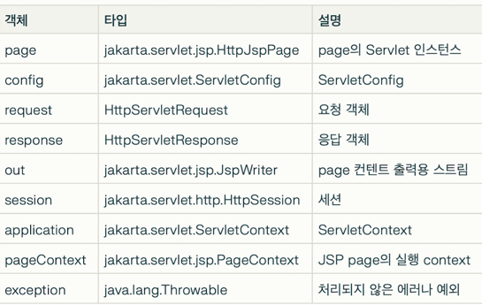

# JSP 내장 객체

markdownCopy# JSP 내장 객체와 Scope 쉽게 이해하기

## 주요 내장 객체
- **request**: 클라이언트의 요청 정보를 담고 있는 객체
- **response**: 클라이언트에게 응답을 보내기 위한 객체
- **session**: 클라이언트별 세션 정보를 저장하는 객체
- **application**: 모든 클라이언트가 공유하는 정보를 담는 객체
- **out**: HTML 출력을 위한 객체
- **pageContext**: JSP 페이지에 대한 정보를 담고 있는 객체
- **page**: JSP 페이지 자체를 나타내는 객체
- **config**: 서블릿 설정 정보를 담는 객체
- **exception**: 예외 처리를 위한 객체

## Scope(범위) 이해하기

### 1. page scope
- 현재 JSP 페이지 내에서만 사용 가능
- 다른 페이지로 이동하면 사용 불가
- `pageContext` 객체로 접근

### 2. request scope
- 하나의 요청이 처리되는 동안 사용 가능
- forward될 때도 값 유지됨
- `request` 객체로 접근

### 3. session scope
- 브라우저가 종료되기 전까지 사용 가능
- 로그인 정보 같은 사용자별 정보 저장에 활용
- `session` 객체로 접근

### 4. application scope
- 서버가 실행되는 동안 계속 유지
- 모든 사용자가 공유하는 데이터 저장
- `application` 객체로 접근

> 💡 **scope의 크기**: page < request < session < application