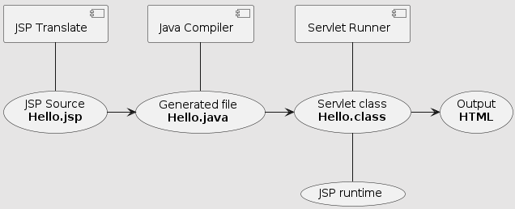

# JSP 동작 구조 


- 컨테이너는 JSP 파일을 HttpJspPage 인터페이스를 구현한 서블릿 클래스로 변환하여 생성

## 1. JSP → Servlet 변환
- JSP 파일을 작성하면 컨테이너(톰캣)이 이를 자동으로 Servlet 클래스로 변환
- 변환된 Servlet은 `HttpJspBase`라는 클래스를 상속받음
- `HttpJspBase`는 `HttpServlet`을 확장한 클래스

## 2. 주요 메서드
1. `jspInit()`
- 서블릿이 처음 시작할 때 실행
- 개발자가 수정 가능

2. `jspDestroy()`
- 서블릿이 종료될 때 실행
- 개발자가 수정 가능

3. `_jspService()`
- 실제 JSP 코드가 실행되는 곳
- 개발자가 수정 불가
- 톰캣이 자동으로 처리

## 핵심 포인트
> JSP 파일을 작성하면 톰캣이 알아서 Servlet으로 변환하고 실행합니다. 우리가 작성한 JSP 코드는 `_jspService()` 메서드 안에 들어가서 실행되며, 이 변환 과정은 톰캣이 자동으로 처리합니다.

---
# global Counter 실습 - 초기값 설정
- jspInit() 메소드를 이용해서 init되는 시점에 counter = 100으로 설정하기

```
<%@ page contentType="text/html;charset=UTF-8" language="java" %>
<html>
<head>
  <title>globalCounter</title>
</head>
<body>
  <%!
    private long counter=0;
    private long increaseCounter(){
      return ++counter;
  }
  public void jspInit(){
      counter=100;
  }
  %>

<h1>counter:<%=increaseCounter()%></h1>
</body>
</html>
```

